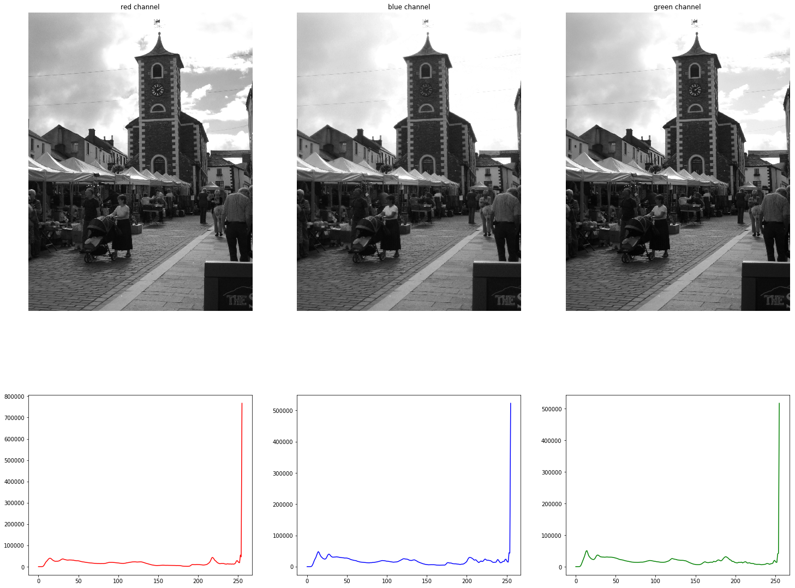
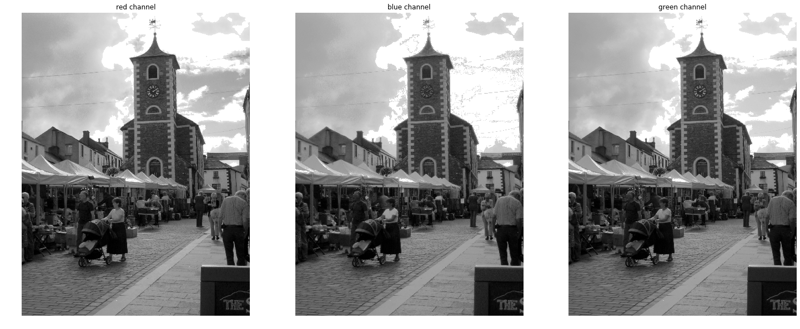
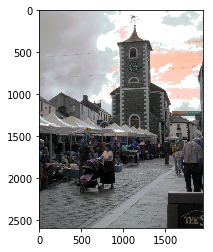

```python
import cv2 as cv
import numpy as np
import matplotlib.pyplot as plt
# Load an color image in grayscale
imgFile = r"C:\Users\micha\bilder\england\IMG_1581.JPG"
img = cv.imread(imgFile)
```

OpenCV stores RBG order  
Matplotlib stores images in RGB order  
Moreover images are returned as numpy arrays  
A color image has 3 channels


```python
np.shape(img)
```


    (2592, 1944, 3)


### splitting the image into red, blue, green images ###


```python
# extracting channels
img_b = img[:,:,0]
img_g = img[:,:,1]
img_r = img[:,:,2]

# calculate histograms
hist_r = cv.calcHist([img], [0], None, [256], [0, 256])
hist_b = cv.calcHist([img], [1], None, [256], [0, 256])
hist_g = cv.calcHist([img], [2], None, [256], [0, 256])
```


```python
fig, axes = plt.subplots(nrows=2, ncols=3, figsize=(25, 20), squeeze=True, gridspec_kw = {'height_ratios':[2,1]})
axes[0,0].imshow(img_r, cmap='gray')
axes[0,0].axis('off')
axes[0,0].set_title("red channel")
axes[0, 1].imshow(img_b, cmap='gray')
axes[0, 1].axis('off')
axes[0, 1].set_title("blue channel")
axes[0, 2].imshow(img_g, cmap='gray')
# a semicolon suppresses output
axes[0, 2].axis('off')
axes[0, 2].set_title("green channel")

# histograms
axes[1, 0].plot(hist_r, color='r')
axes[1, 1].plot(hist_b, color='b')
axes[1, 2].plot(hist_g, color='g');
```


    

    


```python
img_r_eq = cv.equalizeHist(img_r)
img_b_eq = cv.equalizeHist(img_b)
img_g_eq = cv.equalizeHist(img_g)
```


```python
fig, axes = plt.subplots(nrows=1, ncols=3, figsize=(25, 20), squeeze=True)
axes[0].imshow(img_r_eq, cmap='gray')
axes[0].axis('off')
axes[0].set_title("red channel")
axes[1].imshow(img_b_eq, cmap='gray')
axes[1].axis('off')
axes[1].set_title("blue channel")
axes[2].imshow(img_g_eq, cmap='gray')
# a semicolon suppresses output
axes[2].axis('off')
axes[2].set_title("green channel")
```


    Text(0.5, 1.0, 'green channel')


    

    


```python
img_eq = cv.merge((img_b_eq, img_g_eq, img_r_eq))
np.shape(img_eq)
```


    (2592, 1944, 3)


```python
plt.imshow(img_eq);
```


    

    


```python
cv.calc
```


```python

```
